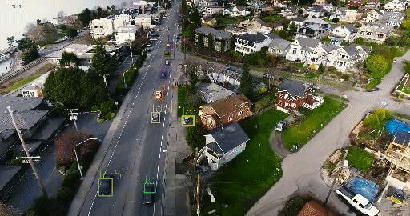
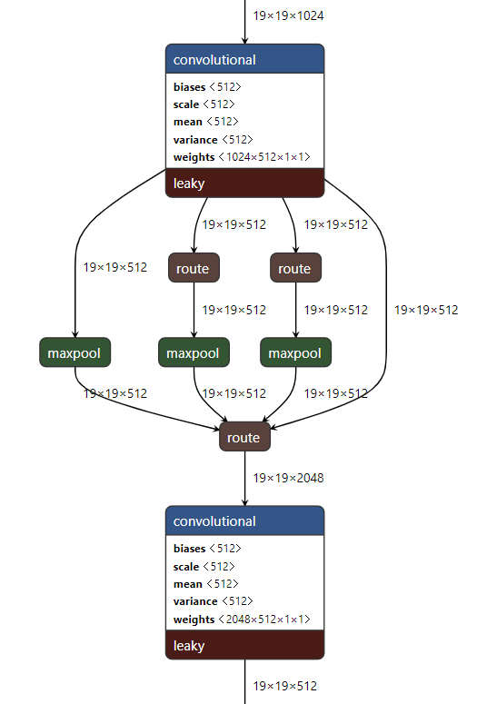

# Dual Tracker

  
A combination of object detection model with visual object tracking.  
Trained to localize and track people, cars, bicycles, motorcycles, buses and trucks.  
Inspired by [UAVH](https://openaccess.thecvf.com/content_CVPRW_2019/html/UAVision/Saribas_A_Hybrid_Method_for_Tracking_of_Objects_by_UAVs_CVPRW_2019_paper.html)
## Detector

YOLOv3 with spatial pyramid pooling  
trained on [stanford dataset](https://cvgl.stanford.edu/projects/uav_data/) and [VisDrone](http://aiskyeye.com/).  
spp in Darknet:  
  
model is taken from [ultralytics](https://github.com/ultralytics/yolov3)
## Tracker
used opencv trackers  

### More References
Spatial Pyramid Pooling paper https://ieeexplore.ieee.org/abstract/document/7005506
DCFCSR https://arxiv.org/pdf/1611.08461.pdf
  
weights can be found [here](https://drive.google.com/file/d/1_zSBfFQqhdWXoelHl9LlnwoqcL9JwstS/view)
