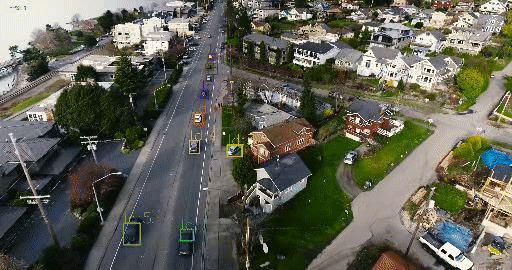
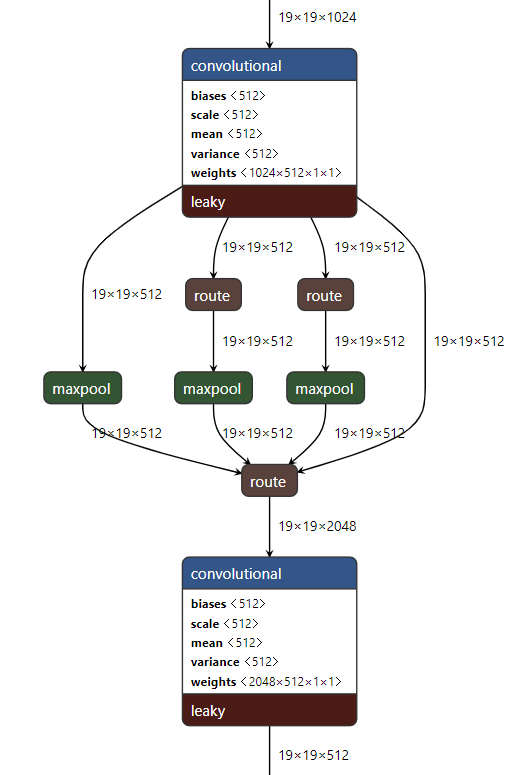

# Hybrid Tracker

## Detector

Here implemented YOLOv3 with spatial pyramid pooling  
trained on stanford dataset and visdrone.  
spp:  
  
model is taken from [ultralytics](https://github.com/ultralytics/yolov3)

## Tracker

opencv trackers

spp paper
https://ieeexplore.ieee.org/stamp/stamp.jsp?arnumber=7005506
